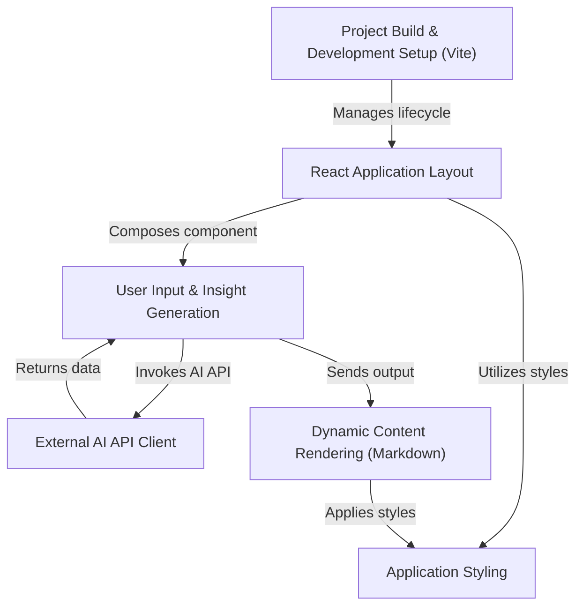

# Tutorial: Insight_Lab

The *Insight Lab* is a **React web application** designed to help users generate in-depth market research and insights for their ideas. Users input details about their concept, and the application then leverages an **external AI model** to provide a comprehensive, structured analysis. This allows innovators to quickly validate and refine their ideas with data-driven feedback.

## Visual Overview

## Chapters

1. [Project Build & Development Setup (Vite)
](01_project_build___development_setup__vite__.md)
2. [React Application Layout
](02_react_application_layout_.md)
3. [User Input & Insight Generation
](03_user_input___insight_generation_.md)
4. [External AI API Client
](04_external_ai_api_client_.md)
5. [Dynamic Content Rendering (Markdown)
](05_dynamic_content_rendering__markdown__.md)
6. [Application Styling
](06_application_styling_.md)

---

Generated by [AI Codebase Knowledge Builder](https://github.com/The-Pocket/Tutorial-Codebase-Knowledge).
